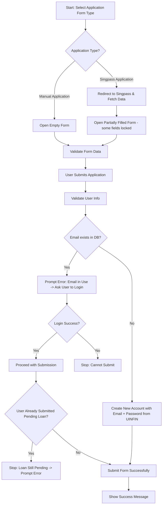
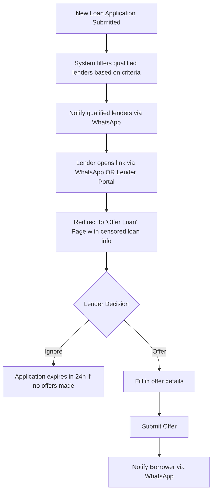
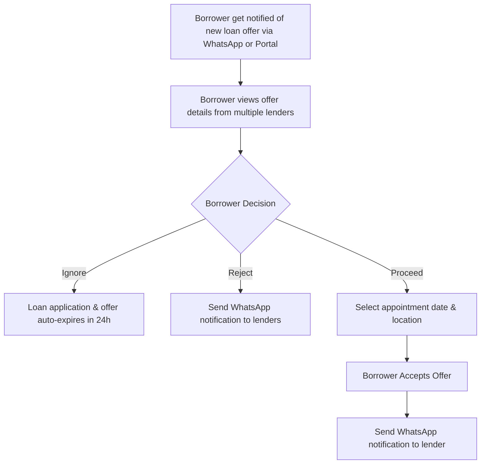

# Compare Loan

Compare Loan is an online loan platform where users can search, compare and apply for loans from various lenders. The platform allows users to input their loan requirements and receive a list of matching loan offers from different lenders. Users can then compare the loan offers based on various criteria such as interest rate, loan tenure, and fees. After selecting a loan offer, users can apply for the loan and track the status of their application.

## Features

- Search and compare loan offers from multiple lenders
- Input loan requirements and receive a list of matching loan offers
- Compare loan offers based on interest rate, loan tenure, and fees
- Apply for a loan and track the status of the application
- User authentication and authorization
- Responsive design for mobile and tablet devices

## Tech Stack

- Frontend: Next.js, React, Tailwind CSS, Shadcn
- Backend: Node.js, Express.js, Google Cloud Functions
- Database: Firebase - Firestore

## Development

### Prerequisites

- Node.js (version 14 or higher)
- Yarn (version 1.22 or higher)
- Firebase (version 11.1.0 or higher)

### Installation

1. Clone the repository
2. Install dependencies using `yarn install`
3. Start the development server using `yarn dev`
4. Open the app in the browser at `http://localhost:3000`

### Deployment

```json
// dev env
yarn deploy:dev

// prod env
yarn deploy:prod
```

## Authorization Roles

- **Borrower Portal** → [https://compare-loan-will.web.app](https://compare-loan-will.web.app)  
   For borrower to submit loan applications and tracking.
- **Lender Portal** → [https://compare-loan-will.web.app/lender](https://compare-loan-will.web.app/lender)  
   For lender to manage new loan application, view appointment, manage payment, manage profile and etc.
- **Admin Portal** → [https://compare-loan-will.web.app/admin](https://compare-loan-will.web.app/admin)  
   For admin to manage all loan application, manage borrowers, manage lenders, manage payment, view appointment, manage payment, manage profile and etc.

<br>

## Workflow

<details><summary><span style="font-weight:bold;font-size:24px">1. Loan Application Submission</span></summary>



</details>

<details><summary><span style="font-weight:bold;font-size:24px">2. Lenders offer/ignore the loan</span></summary>



</details>

<details><summary><span style="font-weight:bold;font-size:24px">3. Loan Offer Acceptance</span></summary>



</details>

<br>

## Reference

- Singpass Official Docs
  https://docs.developer.singpass.gov.sg/docs

- Singpass Test Personas (For testing/dev purpose)
  https://docs.developer.singpass.gov.sg/docs/testing/myinfo-test-personas

- Singpass Data types
  https://docs.developer.singpass.gov.sg/docs/data-catalog-myinfo/catalog

- Compiled Singpass MyInfoData Requirements
  https://docs.google.com/spreadsheets/d/12gPdu_LcsZgXIAgOzP1yj0rlp69jWJRgbLvYy-ICl_Q/edit?gid=0#gid=0

- Meta Business Portal
  https://business.facebook.com/latest/business_home?nav_ref=meta_logo&bm_redirect_migration=true&business_id=1179456520168053 - Used to setup the WhatsApp message template here - Note: Pending to change the template type to non-marketing instead, to prevent the message not being sent

- Meta Developer Portal
  https://developers.facebook.com/apps/706263898641700/whatsapp-business/wa-settings/?business_id=1179456520168053 - Used to manage WhatsApp test phone number here, must add phone number as test number in order to send out the message in staging environment

<br>

## **‼️ IMPORTANT:** Pending Tasks

- [ ] Auto send email when new account is created through new loan application
- [ ] Auto update status to expired for loan application and loan offer
- [ ] Dashboard UI design
  - [ ] UI - Loan application, offered loan application, matched/accepted application (borrower accept), complete application (lender marked as completed)
  - [ ] UI & API - Created Appointment, Missing Appointment, Completed Appointment
  - [ ] UI & API - Total profit
- [ ] Add missing data table’s action functionality
  - [ ] Offer table - View Appointment
  - [ ] Offer table - Update offer status (appointment discussion result → Accept/Reject)
  - [ ] Admin Manage Users - Activate/Deactivate user
  - [ ] Admin Manage Lenders - Activate/Deactivate user
- [ ] Adjust all data table’s filtering
- [ ] Admin page - Manage lender
  - [ ] Left add lender’s rate settings
  - [ ] Auto input the lender’s predefined rate in “Offer loan page”
- [ ] Admin page - Profile page
- [ ] WhatsApp template type need to change to non-marketing in order to allow spam (to avoid message not being sent & received)
